# 🎧 Void Player

  <strong>Your Music. Beautifully Played.</strong>

  A premium offline music player built around your library, your sound, and your way of listening.

  
  
  
  

  Independent project • Designed & built by Shayu

---

## 🌌 The Idea

**Void Player** is an advanced offline music player designed around a simple belief:

> **Music should feel like an experience, not just playback.**

Instead of treating a local music library as a list of files, Void Player turns it into a personal listening environment with dynamic visuals, audio controls, playback automation, analytics, personalization, and a deliberately cinematic interface.

No streaming feed competing for attention.  
No ads interrupting a song.  
Just your music, presented beautifully.

---

## ✨ What Makes Void Player Different

| Experience | What it brings |
| --- | --- |
| 🎵 Local-first playback | Your music stays at the center of the app |
| 🎨 Dynamic themes | Visual atmosphere can change with the experience |
| 💿 Immersive Now Playing | Artwork, motion, particles and playback controls work together |
| 🎛️ Void Studio | Equalizer, spectrum analysis and audio effects in one workspace |
| 🧬 Music DNA | A visual profile derived from listening behaviour |
| 📊 Analytics | Listening time, plays, streaks, heatmaps and achievements |
| ⚙️ Mission Control | Centralized preferences for playback, interface and library behaviour |
| ⏱️ Sleep Timer | Presets plus custom timing |
| 🔒 Hidden Collection | Keep selected tracks out of the main library |
| 🛠️ Diagnostics | Inspect important parts of the audio pipeline |

---

# 🏠 Home — Your Music at a Glance

The Home experience is designed to feel personal from the moment the player opens.

It combines a time-aware greeting, music quote, current playback, library content, and a persistent mini-player into one visual environment.

The active theme can influence the accent colour throughout the interface, so the player does not feel visually frozen in one state.

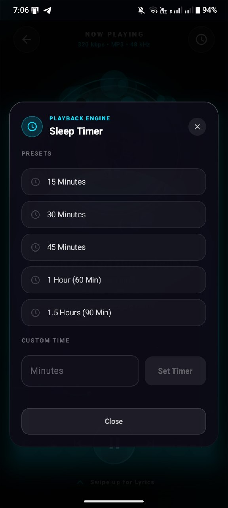

---

# 🔎 Collection Space — Your Local Library

Collection Space turns locally scanned audio into a browsable music environment.

It brings together:

- Scanned track count
- Music folders
- Search
- Available soundscapes
- Track artwork
- Favourite controls
- Quick playback
- Persistent mini-player

The interface is intentionally designed around discovery without turning a local library into another noisy streaming feed.

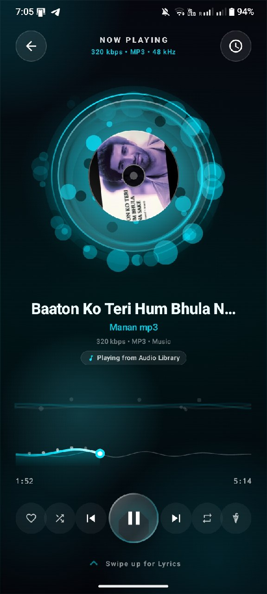

---

# 💿 Now Playing — The Core Experience

The Now Playing screen is the visual heart of Void Player.

It combines:

- High-resolution album artwork
- Vinyl-style presentation
- Animated ambient elements
- Playback progress
- Track metadata
- Favourite control
- Shuffle
- Previous / next
- Repeat
- Primary play / pause control
- Lyrics access

The surrounding visual system is designed to make playback feel alive without overwhelming the actual controls.

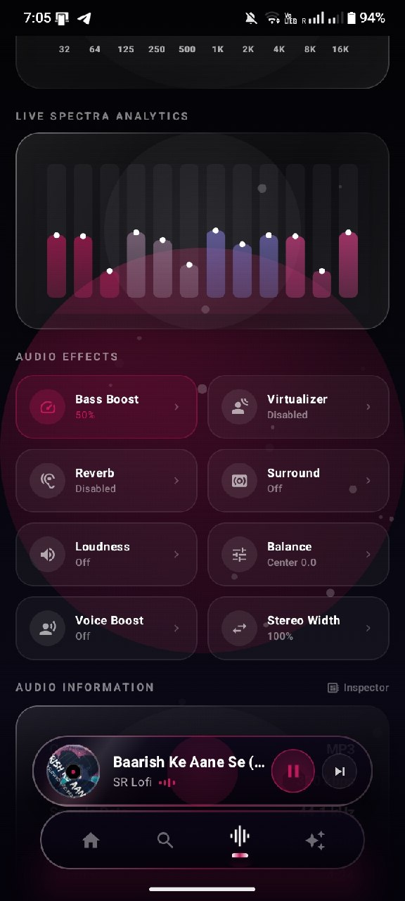

---

# 🎚️ Void Studio — Audio Control Center

**Void Studio** is the dedicated workspace for users who want to go deeper into their sound.

It presents the current audio pipeline alongside equalization and spectrum information.

### Audio Engine Status

Depending on the device and active track, the interface can surface information such as:

- Output device
- Quality
- Sample rate
- Bitrate
- Format
- Channels

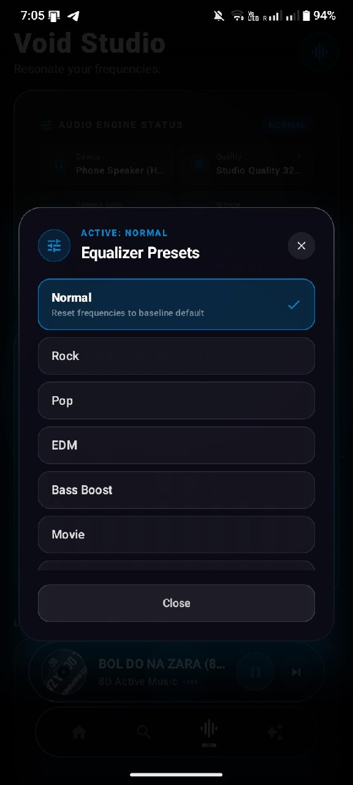

---

## 🎛️ 10-Band Equalizer

Void Player provides a 10-band equalizer across:

text
32 Hz   64 Hz   125 Hz   250 Hz   500 Hz
1 kHz   2 kHz   4 kHz    8 kHz     16 kHz

The equalizer is designed as a direct manipulation interface rather than a wall of technical controls.

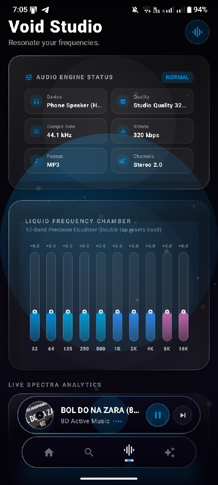

### Presets

Preset choices include:

* Normal
* Rock
* Pop
* EDM
* Bass Boost
* Movie

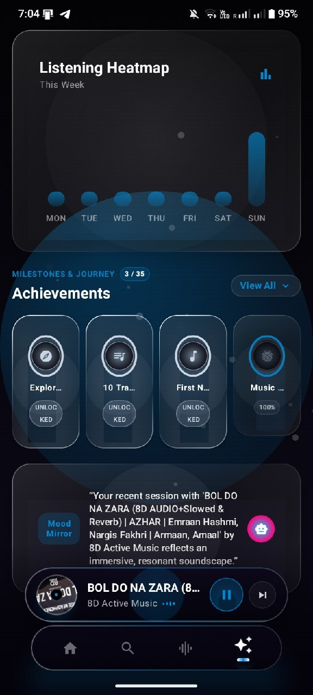

---

# 🔊 Audio Effects

Void Player includes a dedicated effects layer with controls for:

* Bass Boost
* Virtualizer
* Reverb
* Surround
* Loudness
* Balance
* Voice Boost
* Stereo Width

The available effect behaviour can depend on the Android device, output hardware and underlying audio capabilities.

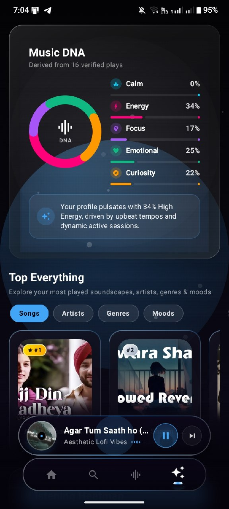

---

# 📡 Live Spectra Analytics

The spectrum view provides a visual representation of the active audio signal.

Rather than using a static decorative equalizer, the interface is designed around live-looking frequency activity so the audio workspace feels connected to playback.

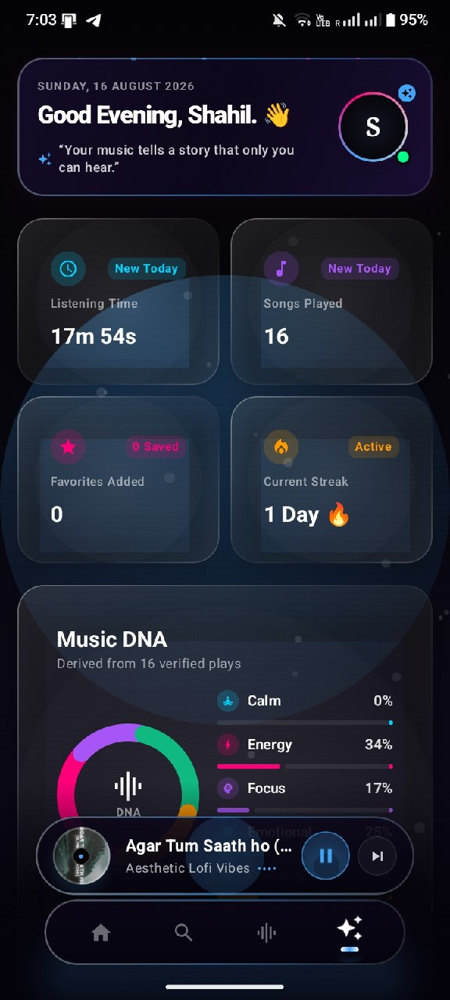

---

# 🧬 Music DNA — Your Listening Profile

Music DNA transforms listening history into a visual profile.

The current model presents dimensions such as:

* Calm
* Energy
* Focus
* Emotional
* Curiosity

The purpose is not to pretend that a music player can read a human soul. Humanity has suffered enough personality tests already. 😌

Instead, Music DNA provides a visual summary of patterns found in listening activity.

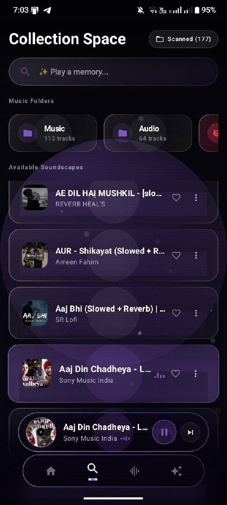

---

# 📊 Analytics — Listening History With Context

Void Player's analytics layer is built around more than a single play counter.

It can surface:

* Listening time
* Songs played
* Favourite additions
* Current streak
* Weekly activity
* Listening heatmap
* Achievements
* Top songs
* Top artists
* Top genres
* Listening moods

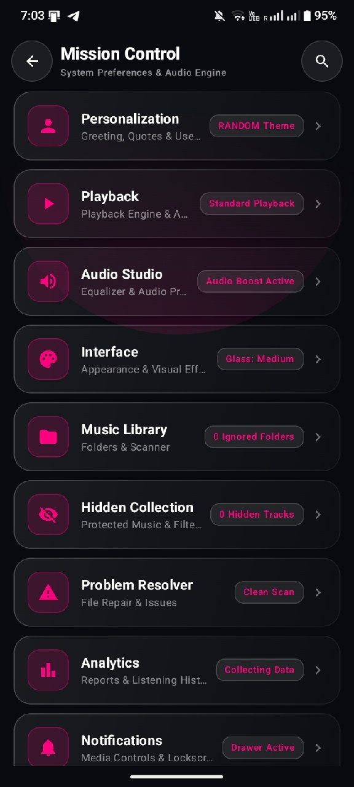

## 🔥 Listening Heatmap & Achievements

The analytics journey can visualise activity across the week and provide milestones for long-term listening behaviour.

Achievements are designed as lightweight milestones rather than a forced gamification system.

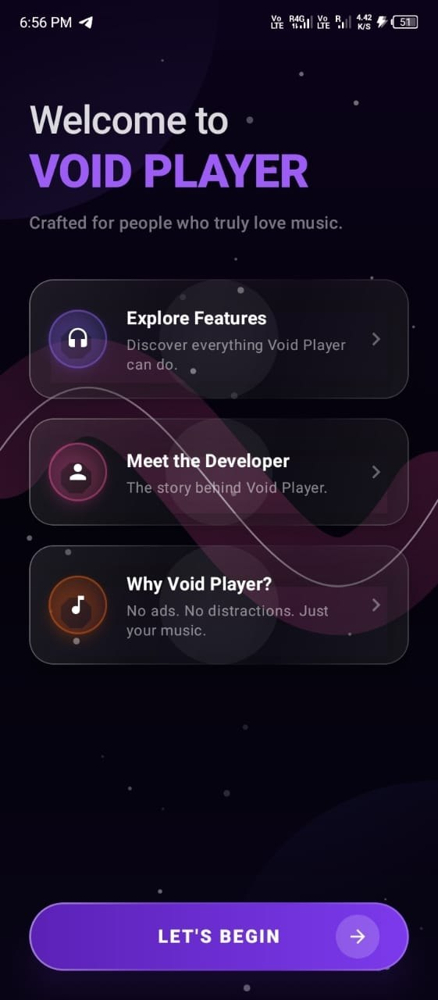

---

# 🎨 Personalization — Make It Yours

Personalization controls the identity of the experience.

### Dynamic Greetings

Greetings can adapt to the time of day.

### Dynamic Quotes

The dashboard can display changing music-oriented quotes.

### Dynamic Theme Animation

Theme changes can use fluid colour transitions instead of abruptly replacing the entire visual system.

### Profile Name

The dashboard can use a personalized profile name throughout the experience.

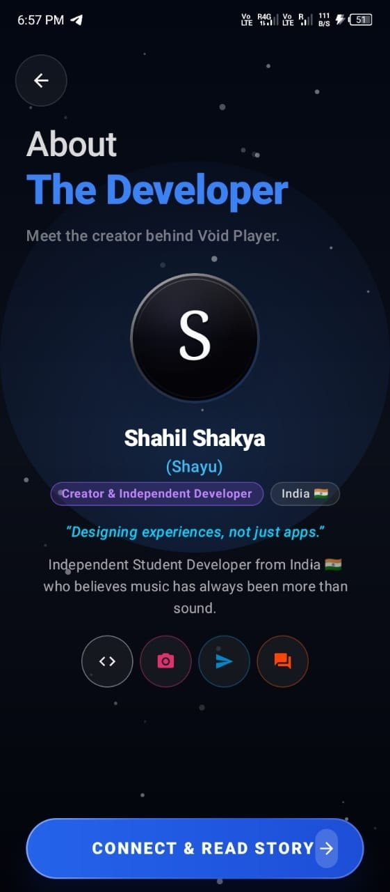

---

# 🌈 Dynamic Theme Engine

Void Player includes multiple approaches to visual theming.

### Solid Airbrush

A focused colour atmosphere built around a primary accent.

### Liquid Gradient

A more fluid visual system for richer background movement and depth.

### Dynamic Random

A large colour pool can be used for changing visual atmospheres.

### Theme Families & Fixed Colours

Users can keep a particular visual family or choose a specific colour instead of relying on randomisation.

The theme system is intended to change the mood of the interface without changing the identity of the application.

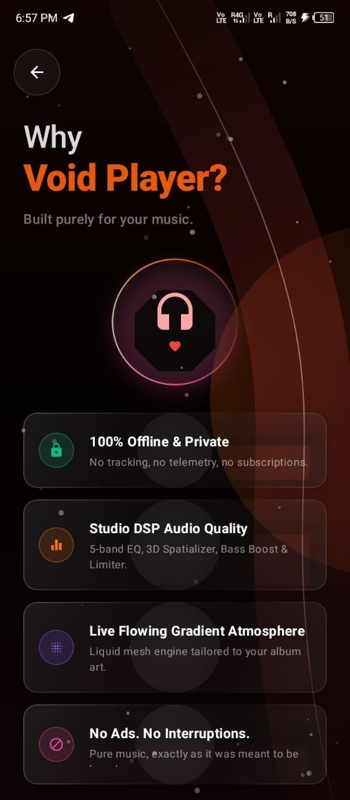

---

# ⚙️ Mission Control

**Mission Control** is the central settings hub for Void Player.

Instead of hiding important controls across disconnected menus, it groups the major systems into clear modules:

* Personalization
* Playback
* Audio Studio
* Interface
* Music Library
* Hidden Collection
* Problem Resolver
* Analytics
* Notifications
* Developer tools

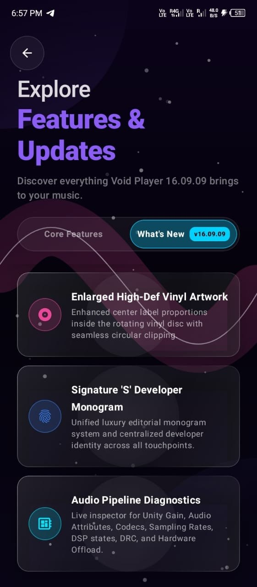

---

# ▶️ Playback Engine & Automation

Playback settings include controls for:

* Resume last song
* Remember exact playback position
* Auto-play when a headset connects
* Pause when a headset disconnects
* Gapless playback
* Crossfade duration
* Sleep timer
* End-of-song pause behaviour

The objective is simple: the player should remember how you listen instead of making you configure the same thing every time.

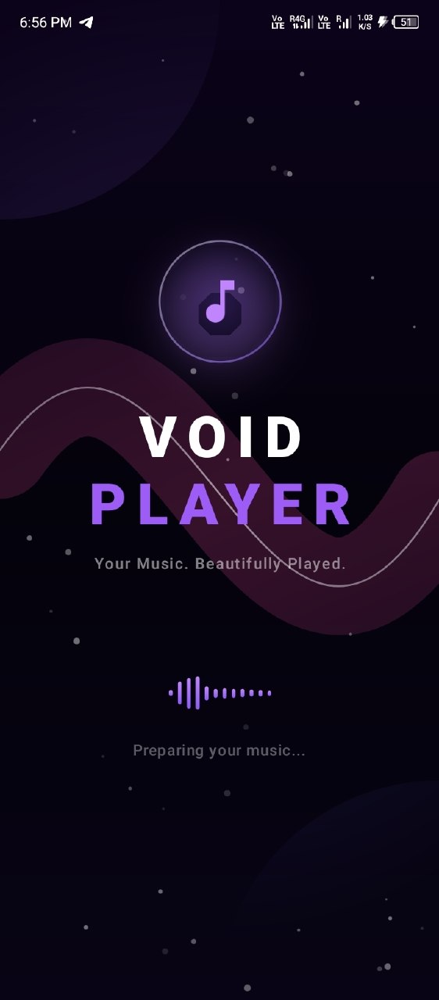

---

# ⏱️ Sleep Timer

Sleep Timer provides quick presets for common listening sessions:

text
15 Minutes
30 Minutes
45 Minutes
60 Minutes
90 Minutes

A custom duration can also be entered when needed.

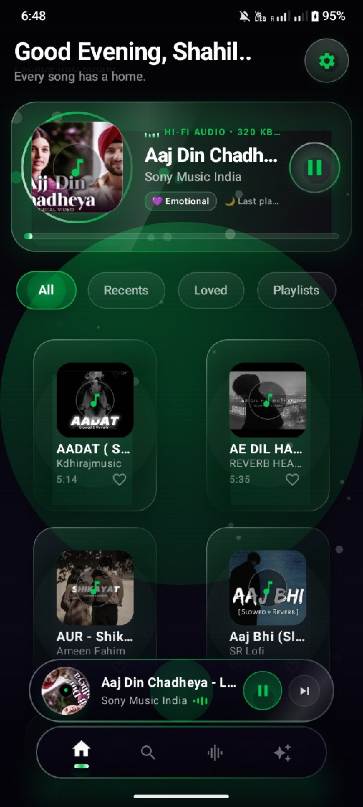

---

# 🗂️ Music Library & Hidden Collection

Void Player is built around local files.

The library system is designed to support:

* Folder scanning
* Track discovery
* Search
* Recent music
* Loved tracks
* Playlists
* Album artwork
* Hidden tracks
* Persistent playback state

The **Hidden Collection** provides a separate place for tracks that should remain protected from the normal browsing experience.

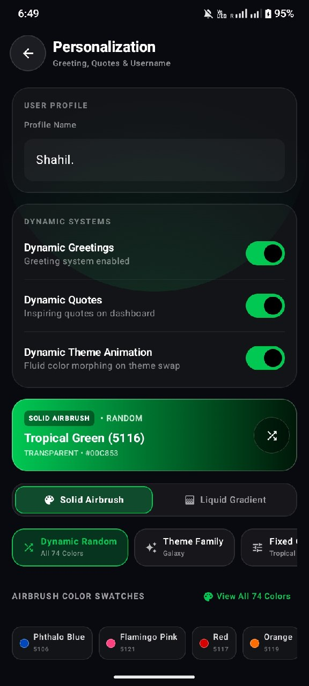

---

# 🛠️ Problem Resolver & Developer Diagnostics

For deeper inspection, Void Player exposes an audio pipeline diagnostics area.

The developer-facing system is intended to make important playback states easier to inspect, including concepts such as:

* Unity gain
* Audio attributes
* Codec
* Sampling rate
* Audio focus
* DSP state
* Dynamic range processing
* Limiter state
* Hardware offload state

The goal is transparency during development rather than hiding the interesting parts behind a black box.

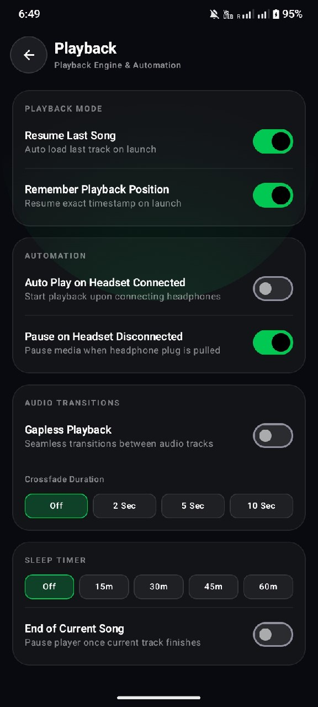

---

# 🔔 Notifications & Media Controls

Void Player is designed to behave like a proper Android media application, including persistent playback controls and media-oriented system integration.

The interface also keeps the active track accessible through a consistent mini-player across major screens.

---

# 🧠 Design Language

Void Player follows a dark, cinematic visual system built around:

* Glass-inspired surfaces
* Soft transparency
* Ambient gradients
* Dynamic accent colours
* Floating particles
* Circular audio motifs
* Layered depth
* Strong typography
* Compact information hierarchy
* Motion that supports the experience instead of distracting from it

The visual language is deliberately expensive-looking without relying on excessive decoration.

---

# 🔐 Privacy Philosophy

Void Player is designed as an offline-first local music experience.

The product philosophy is intentionally simple:

> **Your library should belong to you.**

The app is not built around advertising feeds or a streaming ecosystem. Its primary purpose is to play and organise music already available on the device.

---

# 🚧 Project Status

**Current Version:** 16.09.09 — Aurora

**Status:** Active Development

Void Player is an independent project and continues to evolve through UI experiments, playback improvements, audio-engine work, analytics, performance tuning and new ideas.

Some features shown in the interface may still be experimental or device-dependent.

---

# 🗺️ Direction

The long-term direction of Void Player is to build a complete personal listening environment around local music.

The focus remains on four principles:

**Beautiful** — an interface worth opening.

**Powerful** — serious control when you want it.

**Personal** — the experience adapts to the listener.

**Private** — your local music remains yours.

---

# 👨‍💻 About the Developer

**Shayu**
Independent student developer • India 🇮🇳

Void Player is an independent project created as a combination of software engineering, UI/UX experimentation, audio technology, motion design and data visualisation.

> **Designing experiences, not just apps.**

---

# 📜 The Philosophy

Music is rarely just sound.

Sometimes it is a memory.
Sometimes it is a person.
Sometimes it is a place.
Sometimes it is the only thing that makes a quiet night feel less empty.

Void Player is built around that idea.

Not to replace the music.

Just to give it a better place to live.

---

  <strong>🎧 Void Player</strong>
   
  <em>Your Music. Beautifully Played.</em>
    
  Built with curiosity, code, and an unreasonable amount of attention to tiny UI details.
   
  <strong>— Shayu 🇮🇳</strong>

